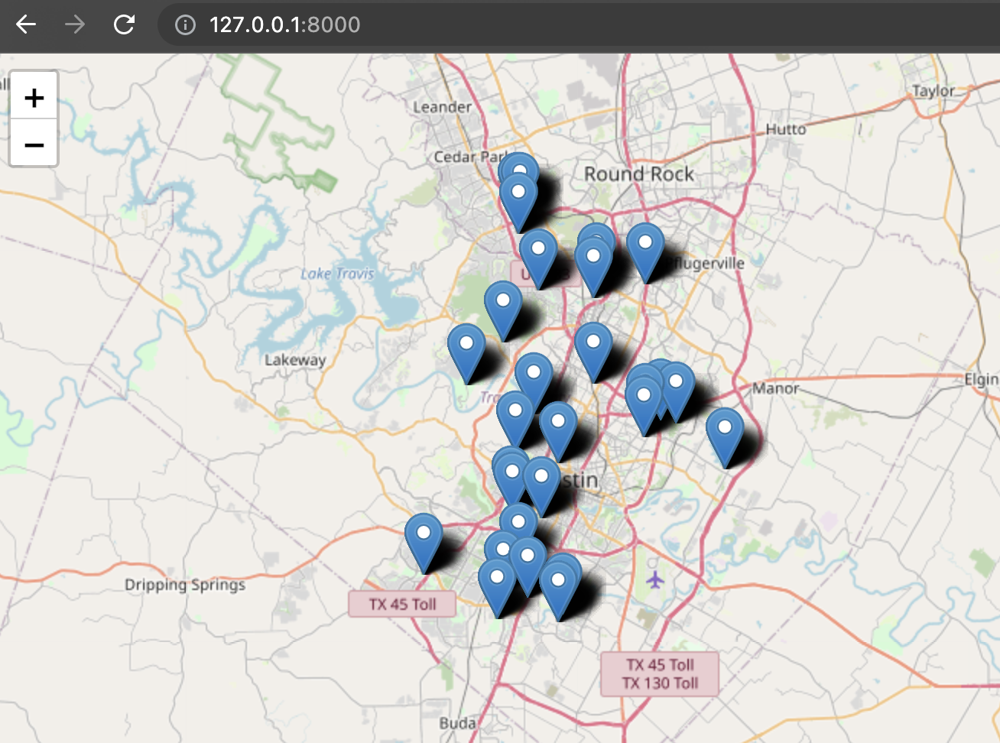

# ATX Parks Map

A web map containing Austin parks. A leaflet.js front end consumes a RESTful API provided by Django REST framework. All requirements can be installed by running `pip install -r requirements.txt`.

## Environment variables with django-environ

In order to load environment variables for database connection, create a `.env` file in the same location and including the same content as `.env.example`.

## Database

The [kartoza postgis](https://hub.docker.com/r/kartoza/postgis/) Docker image provides a container with PostgreSQL and PostGIS. The database is populated by the second migration which parses a json file. This json file contains the results of running the query `parks in Austin` on [overpass turbo](https://overpass-turbo.eu/), which itself searches [OpenStreetMap](http://www.openstreetmap.org/).

## Files of note

* `atxparks/settings.py` - uses `.env` to securely connect to database
* `markers/models.py` - contains Marker model that informs migration, API, viewset etc.
* `markers/migrations/002_auto_....py` - contains instructions for reading `data/osm_parks.json` and populating database table with info including Point objects, which consist of latitude/longitude coordinates
* `markers/serializers.py` - contains a serializer, which converts complex data (in this case the Point object) into a type more easily digestible for API (in this case GeoJSON)
* `markers/viewsets.py` - contains a read-only viewset to enable exposing markers via a RESTful API. Sets location as a field to filter markers, and a filter based on the bound box
* `markers/api.py` - uses the Django REST framework default router to create API endpoint
* `markers/static/map.js` - Javascript used for front end. Attempts to sense user's location, defaults to Austin downtown if location not found. When user ceases moving the map, the endpoint is queried asynchronously, using the specific displayed map area as a filter, passed as a boundbox string. This is invoked every time the user ceases moving the map.